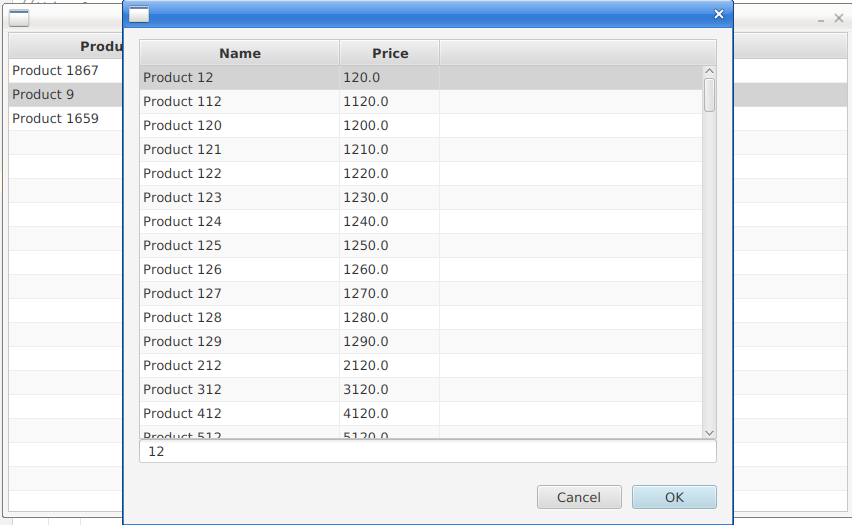

# JavaFXCustomChoiceDialogFromLargeTable
JavaFX How To: Custom choice dialog from large table

In business applications development it's often user task to fill table with data from another table.
And it's not problem if source has few rows, but what if it has large amount of rows (>1000)?
This project shows how to make choice dialog from another table, how to custom dialog and add table to it and get choosed value.
Hope it will be helpful.

It's how dialog looks like:

To invoke the dialog you can with double click on any value within Product column.
Dialog also allow you to filter rows with some string.

Project structure:
ru.vlsoft.controllers.MainFormController - controller of the main form, which contain table with some simple data
  
ru.vlsoft.models.BaseObject - abstract class, base for other models (entities)
ru.vlsoft.models.Country
ru.vlsoft.models.Product
ru.vlsoft.models.TableDetails - model for simulating, for example, lines of the sales receipt
  
ru.vlsoft.table_cells.ProductTableCell - extends TableCell
  
ru.vlsoft.view_models.ProductListViewModel - used for creating choice dialog content with tableView and textField for filter
  
ru.vlsoft.GeneralUtils - utilite-class, for data generating
ru.vlsoft.MainClass - class with main method
